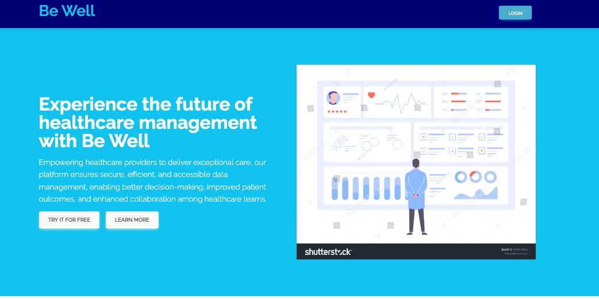

    
    
    
     
    
    
    
     
   
    
    
    
    

<h1 align="center"><b>BeWell</b></h1>
<h4 align="center">A cutting-edge Electronic Health Records (EHR) system that revolutionizes healthcare management. Empowering healthcare providers to deliver exceptional care, our platform ensures secure, efficient, and accessible data management, enabling better decision-making, improved patient outcomes, and enhanced collaboration among healthcare teams.</h4>

    

## Table of Contents

- [Introduction](#introduction)
- [Technical Requirements](#technical-requirements)
- [Project Structure](#project-structure)
- [Key Features](#key-features)
- [Getting Started](#getting-started)
- [Usage](#usage)
- [Dependencies](#dependencies)
- [Contributing](#contributing)
- [License](#license)

## Introduction

Your EHR System Name provides an innovative solution for healthcare data management. It offers a user-friendly interface and a wide range of features to streamline the healthcare process. With our EHR system, healthcare providers can easily access and manage patient data, schedule appointments, track medical histories, and collaborate with other professionals.

## Technical Requirements

To run Your EHR System Name locally, you need the following:

- Python 3.7 or later
- Flask (add version)
- SQLAlchemy (add version)
- React (add version)
- Other dependencies (list them with versions)

## Project Directory Hierarchy

Upon successful setup (see **Getting Started**), you should see the following project directory hierarchy.
